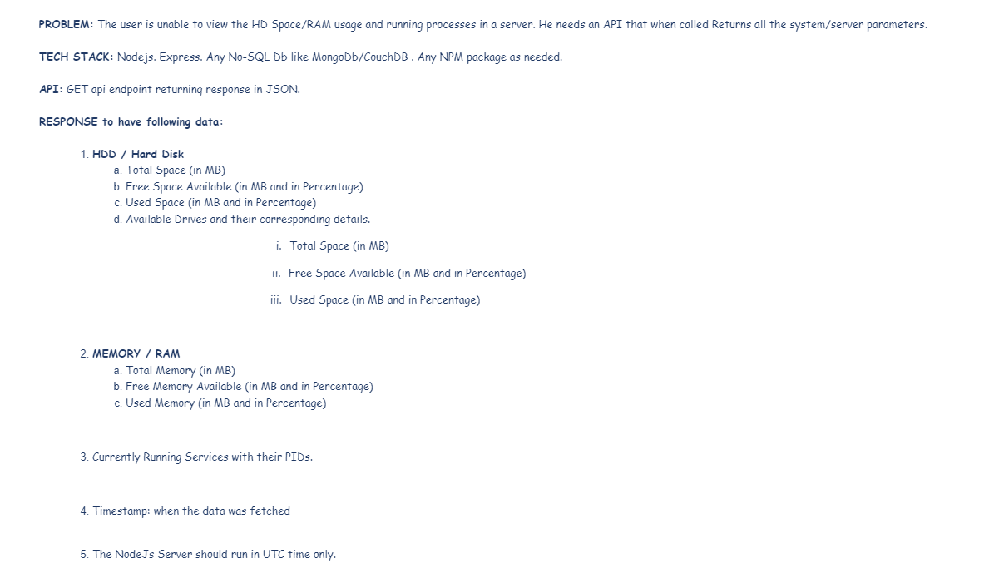

# abroadworks-assignment

## Assignment

  



  

## Solution
### Tech Stack
- Node.js
- Express.js
- Typescript
- MongoDB


### Getting started

1. Install the required packages
    ```bash
    cd abroadworks-assignment
    npm install
    ```

2. Update the .env file
    ```bash
    cp .env.example .env
    ```

3. Start the server
   
    ```bash
    npm run dev
    ```

